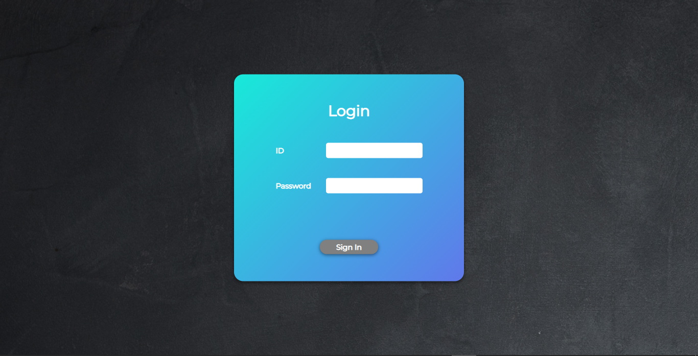
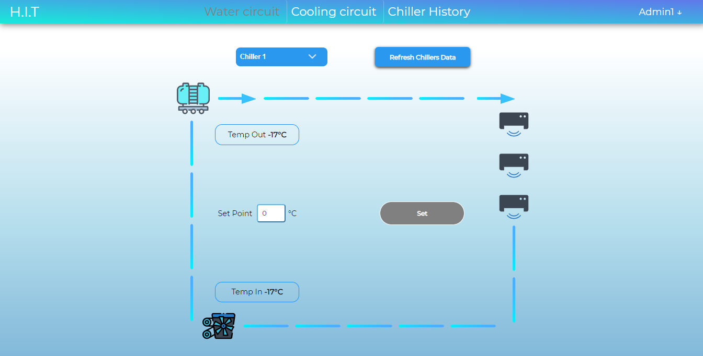
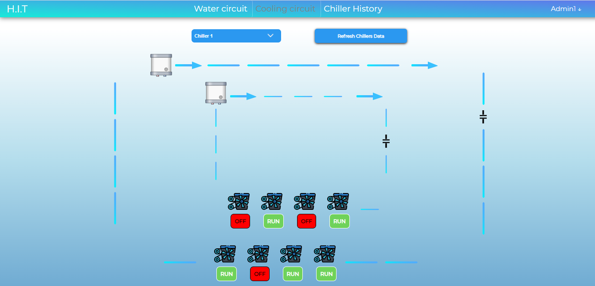
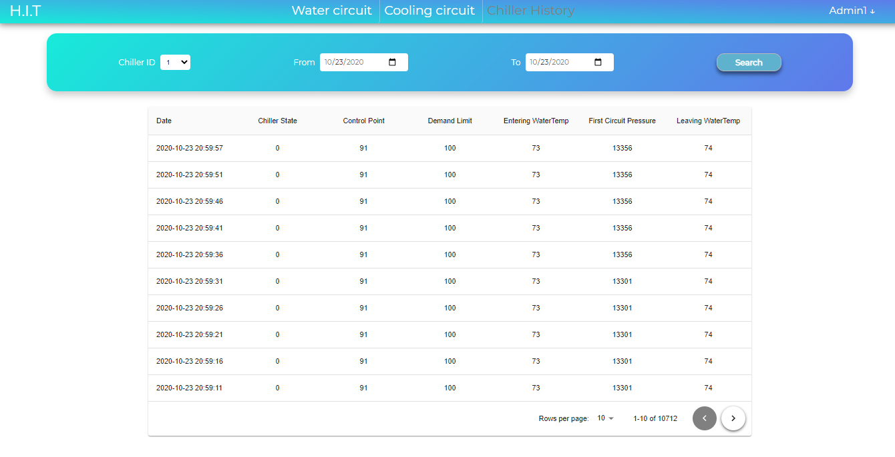
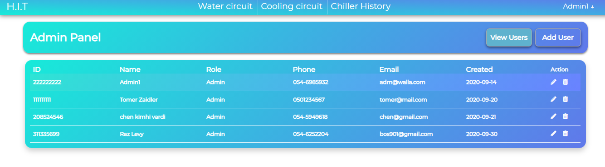
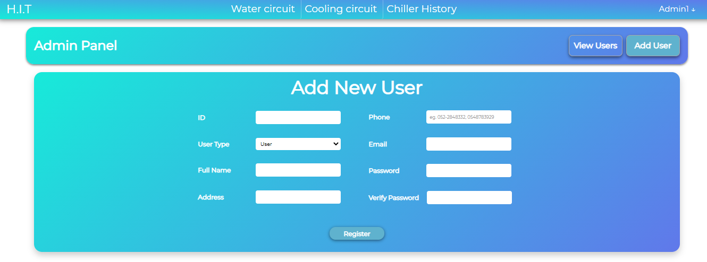

# Chillers Management System
Building an interactive management interface Controlling the merger system at H.i.T College and making the information in Real-Time technology accessible to the interface

## Used Platforms
- ReactJS
- Redux
- NodeJS
- MongoDB

## Installation Instructions
Download the repository and use `npm install` to install all the related modules. 

## Pictures
### Login page where the user can sign in to the app

### water circuit page - In this page the user can set the temp of specific chillers water circuit

### cooling circuit page - In this page the user can see which of the Compressor is running 

### chiller history page - In this page the user can view the history of the chiller by selected dates and specific chiller

### view users page - In this page the admin can view all of the users 

### add users page - In this page the admin can add new users to the app

